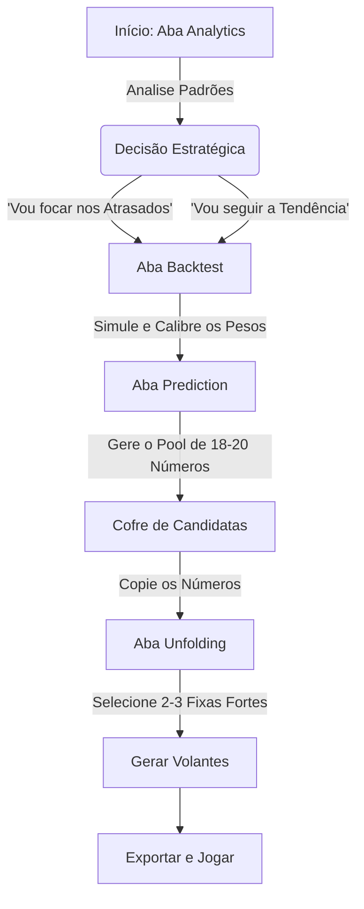

# Manual de Treinamento e Operação: Loto Analyst Pro

**Bem-vindo ao Loto Analyst Pro!**
Este manual foi desenhado para transformar você, usuário, em um operador avançado desta ferramenta. O software não é apenas um gerador de números aleatórios; é uma **estação de trabalho estatística**. Para extrair o melhor dele, você precisa entender como suas partes se conectam.

---

## 1. Visão Geral das Funcionalidades

O sistema está dividido em 4 módulos principais (Abas), cada um com um propósito específico no seu fluxo de decisão.

| Ícone | Módulo | Função Principal |
| :--- | :--- | :--- |
| 📊 | **Analytics** | **Diagnóstico**. Entender o comportamento passado e atual das dezenas. |
| 🔮 | **Prediction** | **Inteligência**. Onde a IA pondera e sugere as melhores dezenas (Candidatas). |
| 🔢 | **Unfolding** | **Construção**. Transforma suas dezenas candidatas em jogos reais (volantes). |
| 🔙 | **Backtest** | **Validação**. Testa se sua estratégia teria funcionado no passado recente. |

---

## 2. Detalhando as Ferramentas

### 📊 Aba: Analytics (Estatística)
Aqui você coleta **evidências**. Antes de jogar, você precisa saber o "clima" do jogo.
- **Top Hottest**: As dezenas que mais saem. *Dica*: Geralmente a base de um bom jogo contém 60-70% de números quentes.
- **Most Delayed (Atrasadas)**: Números que não saem há muito tempo. *Dica*: Apostar em 1 ou 2 atrasadas é esperto, mas apostar em TODAS as atrasadas é estatisticamente arriscado.
- **Gráficos de Paridade e Soma**:
    - *Paridade*: Veja se o padrão é sair mais Pares ou Ímpares. Se o gráfico mostra equilíbrio (50/50), evite jogos com 10 pares.
    - *Soma*: A maioria dos resultados cai no "meio" da curva de sino. Jogos com soma muito baixa (ex: 1,2,3,4...) ou muito alta são raros.

### 🔮 Aba: Prediction (Previsão)
O cérebro do sistema. Aqui você não escolhe números um a um, você define **pesos** para a IA escolher.
- **Pool Size**: Quantos números você quer selecionar? (Recomendado: 18 a 21 para Lotofácil).
- **Pesos (Sliders)**:
    - *Weight Frequency*: Aumente se quiser focar em números que já estão saindo muito ("surfar a onda").
    - *Weight Delay*: Aumente se acredita que os números sumidos vão voltar ("reversão à média").
    - *Weight Trend*: Foca no curtíssimo prazo (últimos 10 jogos).
- **O Resultado**: O sistema gera um **Candidate Pool** (ex: 18 números). Anote esses números! Eles são a "matéria-prima" para a próxima aba.

### 🔢 Aba: Unfolding (Desdobramento)
Onde você cria os jogos de fato.
- **Select Numbers**: Insira aqui o *Candidate Pool* que você gerou na aba anterior.
- **Fixed Numbers (Fixas)**: O "pulo do gato". Se você tem muita certeza sobre 2 ou 3 números daquele Pool, marque-os como fixos. Isso reduz drasticamente o custo do jogo e foca seus volantes neses números.
- **Max Games**: Limite quantos jogos quer gerar para caber no seu bolso.

### 🔙 Aba: Backtest (Simulação)
Use esta aba para **calibrar** seus pesos na aba *Prediction*.
- Se você rodar o Backtest e ver que a IA acertou pouco nos últimos 10 jogos, talvez seus pesos (Freq vs Delay) precisem de ajuste.
- Se a performance foi boa, é sinal verde para usar a mesma estratégia no próximo jogo real.

---

## 3. O Fluxo de Ouro: Como Gerar Jogos Assertivos

Não use as abas aleatoriamente. Siga este "Pipeline de Decisão" para maximizar suas chances estatísticas.

### Exemplo Prático de Uso (Roteiro)

**Cenário**: Você vai jogar na Lotofácil.

1.  **Passo 1 (Análise)**: Você vai na aba *Analytics* e vê que o número **05** e **23** estão muito atrasados. O número **10** sai todo jogo.
2.  **Passo 2 (Calibração)**:
    -   Vai na aba *Prediction*. Configura *Pool Size* = 19.
    -   Coloca *Weight Delay* um pouco mais alto (0.6) para tentar capturar os atrasados 05 e 23.
    -   Coloca *Weight Freq* médio (0.4) para manter a base sólida.
3.  **Passo 3 (Geração)**: Clica em "Generate". A IA te dá uma lista de 19 números prováveis. Você confere: o 05 e o 23 estão lá? Ótimo.
4.  **Passo 4 (Criação)**:
    -   Vai na aba *Unfolding*.
    -   Seleciona os 19 números sugeridos pela IA no campo "Select Numbers".
    -   No campo "Fixed Numbers", você decide confiar na estatística e fixa o número **10** (que está quente) e o **05** (que tem que voltar).
    -   Pede para gerar 10 jogos.
5.  **Resultado**: Você tem 10 volantes altamente otimizados, cobrindo um leque de 19 números, com 2 fixos estratégicos, balanceados entre estatística fria e tendência recente.

---

## 4. Dicas Finais

> [!TIP]
> **Consistência é chave**. Não mude de estratégia a cada sorteio. Teste uma configuração de pesos no Backtest por um período (ex: 20 sorteios) e, se ela se mostrar lucrativa na simulação, mantenha-a.

> [!WARNING]
> **Probabilidade vs Certeza**. Lembre-se que ferramentas estatísticas aumentam a *probabilidade* de acerto ao eliminar combinações absurdas (como 1,2,3,4,5...), mas a aleatoriedade do sorteio físico é soberana. Jogue com responsabilidade.

Bom jogo e boas análises!
